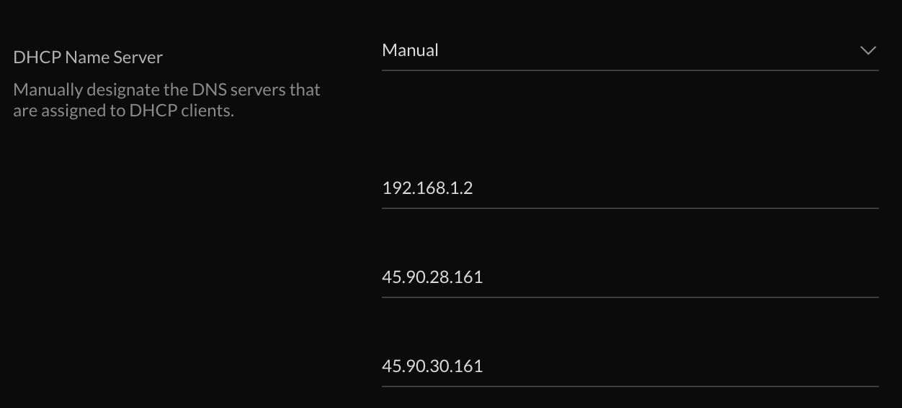
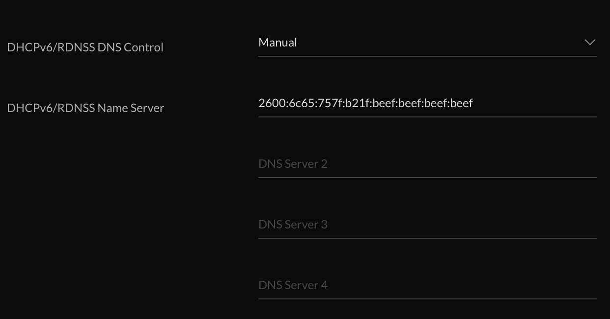

Unifi DNS Leakage Control Scripts
=================================

Patrick Wagstrom &lt;patrick@wagstrom.net&gt;

July 2021

Overview
--------

It's a pretty well known fact that ISPs can learn a lot about you just by what
hosts you're looking up with DNS. In fact, because most DNS lookups are done
unencrypted, even if you're not using the DNS servers provided by ISP, they can
still see what you're looking up. And _they really do look at these lookups_.
Trust me on this. Furthermore, while you can install something like Pi-Hole or
AdGuard home, they'll still be able to see the lookups once they leave your
network.

Now, you can be clever and have Pi-Hole and AdGuard Home send all their queries
to a local instance of NextDNS Proxy or CloudflareD - this will ensure that the
requests are encrypted leaving your local network. But what about the
increasing number of devices that can be broadly categorized into the "Internet
of Crap" that have hard-coded IP addresses? How do you keep them from getting
out? What about devices that think they're clever because they use DNS over
HTTPS to look up their hosts?

Also, if you've got IPv6 enabled, did you know that your UDM Pro will gladly
pass through your ISPs IPv6 DNS host and therefore make it ignore your
settings? Yeah, it's annoying. Furthermore, there's no way in the UDM Pro to
customize DNS options over IPv4 or IPv6 to be null, which essentially means
"don't use this protocol for DNS".

Well, we might be able to do something about that.

These scripts accomplish two primary things:

1. Redirect all outbound DNS queries over IPv4 and IPv6 to a host on your local network.
2. Block outbounds DNS over HTTPS requests from leaving your network

Installation
------------

1. Install the [udm-utilities package from boostchicken](udm-utilities) on your
   UDM Pro.
2. Configure the scripts as described in the configuration settings.
3. Copy the shell scripts to `/mnt/data/on_boot.d` on your UDM Pro.
4. Log in and run the scripts manually, or reboot your UDM Pro.

Configuration
-------------

### 10-redirect-all-dns.sh

- `BACKUP_IP4_DNS`, `BACKUP_IP6_DNS`:
One of the first things that you'll want is the IP addresses of your secondary DNS for both IPv4 and IPv6. The settings currently in the file are for NextDNS. These should be the same IP addresses that you've configured in the GUI for your UDM Pro for your LAN network.

**IPv4 DNS Configuration - 192.168.1.2 is my Pi-Hole, the other two are NextDNS Backup**

**IPv6 DNS Configuration - 2600:6c65:757f:b21f:beef:beef:beef:beef is my Pi-Hole static IPv6 address, I don't use IPv6 backups.**

- `PIHOLE_IP4_HOST`, `PIHOLE_IP6_HOST`
These are the static IP addresses of your PiHole for both IPv4 and IPv6. Any outbound IPv4 DNS request will go to `PIHOLE_IP4_HOST` and any IPv6 request will be redirected to `PIHOLE_IP6_HOST`. Note: these should be static addresses.

- `IP4_NO_REDIRECT`, `IP6_NO_REDIRECT`
Hosts listed in these settings will be able to send DNS requests to any host anywhere in the world. Consider this as a bit of a DNS back door.

License
-------

Copyright (c) 2021 Patrick Wagstrom

Licensed under terms of the MIT License

[udm-utilities]: https://github.com/boostchicken/udm-utilities
